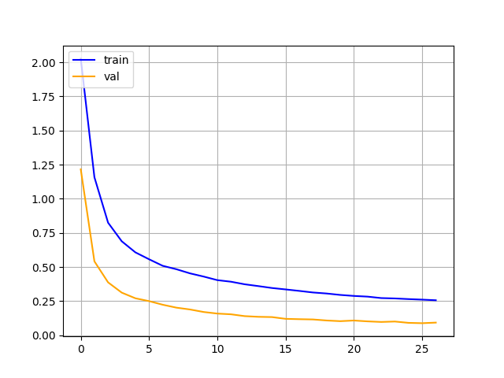
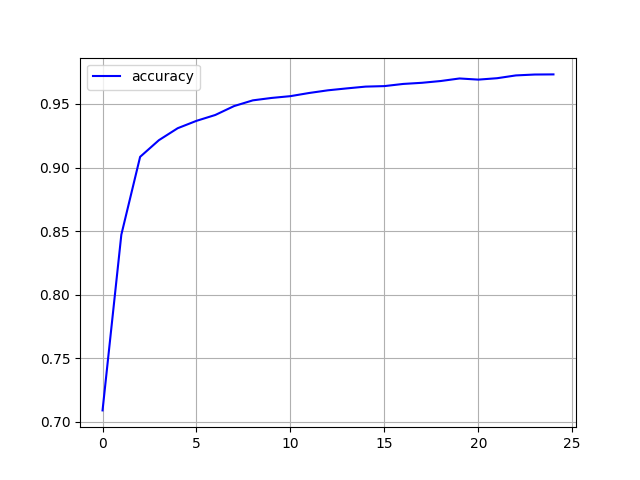
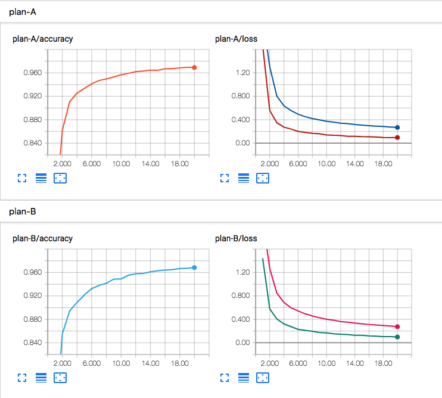

# Minetorch


In [Minecraft](https://minecraft.net/), torches are very important for mining. No one can get all the diamonds without torch. So is data-mining, A special torch named [PyTorch](http://pytorch.org/) can help us get the dimonds in data. Minetorch is a tools collection for miners, to use PyTorch in a more convinent way.

## Features

* Logging of course.
* Visualization. Built in with Tensorboard or Matplotlib.
* Resumption. Default will resume from the last checkpoint.
* Many hook points.
* Training code. Or actually a namespace, used to easily sperate different training status.

## Installation

```
pip install minetorch
```

## Quick Start

1. Clone this repo

```
git clone git@github.com:louis-she/minetorch.git
```

2. Goto examples and execute

```
python mnist.py
```

The `mnist.py` is pretty much like PyTorch official mnist example https://github.com/pytorch/examples/blob/master/mnist/main.py, with some minor changes to be adapted to Minetorch.

This will create a `alchemistic_directory` and `data` directory in working directory.

3. Execute tensorboard to visualize

```
tensorboard ./log
```


or if you used `matplotlib` as drawer, there will be 2 images under the path `${alchemistic_directory}/${code}/graph` named loss.png and accuracy.png

loss.png             |  accuracy.png
:-------------------------:|:-------------------------:
| 


> Note: Since PyTorch 1.0 comes with CUDA10 but the newest version of Tensorboard just supported CUDA9, so if you are using Tensorboard as drawer, make sure you got CUDA9 installed, or it's better to use matplotlib. Due to this, Minetorch default drawer has changed to matplotlib instead of Tensorboard.

4. Now let's change the loss function to cross_entropy(just follow some instructions in the comments of `mnist.py`), and train the mnist again.



## How it works

Minetorch let users focusing on **the only** necessary things, and will take care of the others. It's more like a skeleton and users should provide necessary components to make it work.

The parameters users must provided:

| parameters | type | description |
| ---------- | ---- | ----------- |
| alchemistic_directory | string | path of a directory, all the `checkpoint`, `log` or `graph` will be saved in this `alchemistic_directory` |
| train_dataloader | torch.utils.data.DataLoader | Used to tell minetorch how to load training data |
| model | torch.nn.Module | PyTorch's nn.Module |
| loss_func | callable | A special hook function, should receive 2 arguments: `data` which yields by the loader and `trainer` which is the trainer instance, this function should return a single scalar which is the loss |

And that's it, minetorch will take care of others things like `logging`, `resumming`, `visualization` etc... The names of the components are actually the parameters of the `Trainer` class. The other optional parameters are:

| parameters | type | description |
| ---------- | ---- | ----------- |
| val_dataloader | torch.utils.data.DataLoader | Used to tell minetorch how to load validation data |
| resume | bool or string  | Defaults to True, means the minetorch will try to resume from the latest checkpoint, if a string is given then minetorch will resume from a specified checkpoint, the string could be number of epoch, name of the checkpoint file or absolute path of the checkpoint file, false means train from scratch|
| eval_stride  | int | Defaults to 1, how many epochs to run a validation process |
| persist_stride  | int | Defaults to 1, how many epochs to save a checkpoint |
| drawer  | minetorch.Drawer or string | Defaults to 'matplotlib'. To generate graphs of the whole training process, now support 'tensorboard' and 'matplotlib', can also write a customized Drawer by yourself |
| code  | string | it's actually a sub directory path of `alchemistic_directory`, for sperating the results of different attempts, every attempts should have a uniq name |
| hooks | dict | Defining hook function, see [Hooks](#hooks) |
| max_epochs | int  | How many epochs to train, defaults to None, means unlimited |
| logging_format | string  | Defaults to '%(levelname)s %(asctime)s %(message)s', same as logging's format |
| trival | bool  | Defaults to False, if set to True, both training and validation process will be breaked in 10 iterations, useful at development stage |
| in_notebook | bool  | Defaults to False, if use minetorch in jupyter notebook environment, set this option to True to have a better output |
| statable | dict  | Defaults to {}. A statble is an object which has implemented `state_dict` and `load_state_dict`, pass these objects in statable dict will let minetorch handle the load and save operation on it. For instance, Learning Rate Schedular is a tipical statable object. Don't put optimizer and model here, minetorch already know that they are statble.|

## Hooks

Minetorch provided many hook points for users to controller the training behaviors. All the hook function receive currnet `trainer` instance as the arguments so the hook function can access all the functions and status of `Trainer`.

| hook points | description |
| ----------- | ----------- |
| after_init | called after the construct function of Trainer been called |
| before_epoch_start | called before every epoch started |
| after_epoch_end | called after every epoch ended |
| before_train_iteration_start | called before every training iteration started |
| after_train_iteration_end  | called after every training iteration ended |
| before_val_iteration_start | called before every validation iteration started |
| after_val_iteration_end  | called after every validation iteration ended |
| before_checkpoint_persisted | called before checkpoint persisted |
| after_checkpoint_persisted | called after checkpoint persisted |
| before_quit | called before the max_epochs exceeded and about to quit training |

## TODOs

- [x] More hook points.
- [ ] Number of x axis of Drawer generated images are not changed after resume from checkpoint.
- [ ] Drawer DB Adapter. To persist drawer data to db and then can be visualization by any tools.
- [ ] Graceful exists.
- [ ] Dockerize.

